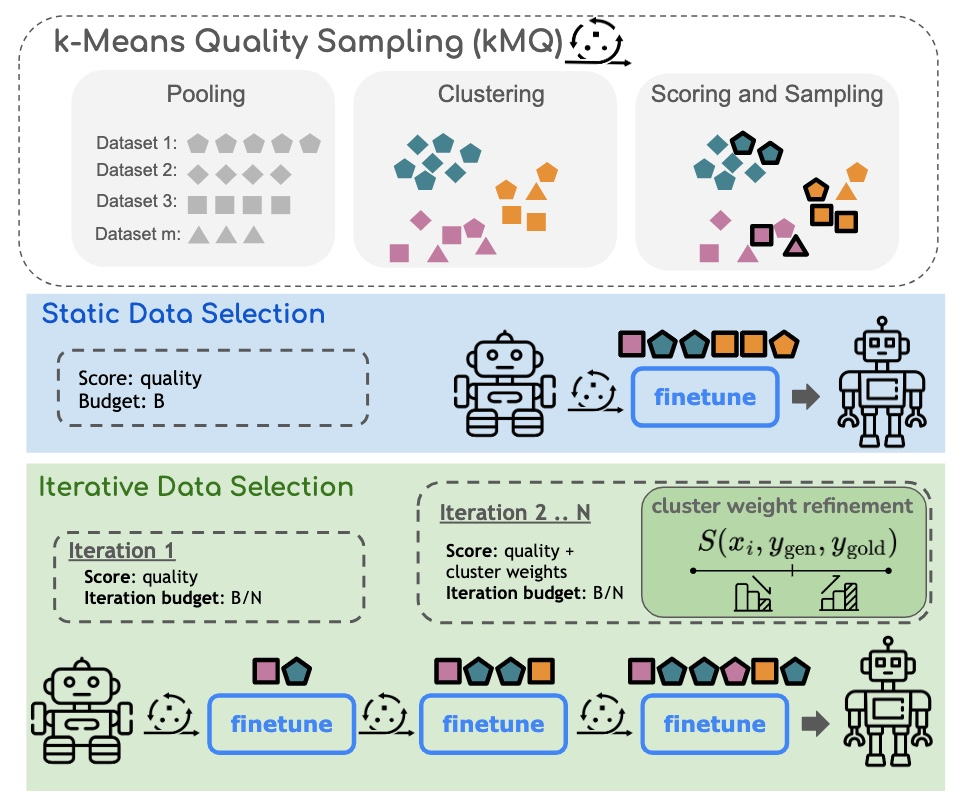

# Selecting Diverse Instructions

This repository contains the official code for the paper: [Diversify and Conquer: Diversity-Centric Data
Selection with Iterative Refinement](https://arxiv.org/abs/2409.11378).




### Dataset

To download the datasets used in this project, run [this script](https://github.com/allenai/open-instruct/blob/main/scripts/data/prepare_train_data.sh). We used Alpaca, ShareGPT and WizardLM datasets for training and evaluation.

After downloading, datasets will be stored in the `data/processed` directory of the project.


### Coreset Selection
The hyperparameters and configurations are managed by [Hydra](https://hydra.cc/). The configurations are stored in `selection/config/`.
You should run the code by executing `main.py` in the `selection` directory. You can also specify the hyperparameters by command line arguments.
```bash
cd selection
python main.py data=[sharegpt|wizardlm] encoder=miniLM coreset=random
```
The selected indices are stored under `selection/indices/`.


### Finetuning
```bash
# Llama-2-7b-hf (with accelerate and deepspeed)
bash scripts/finetune_llama_with_accelerate.sh [INDICES]
```
Iterative selection is implemented in the `scripts/iter/` directory.

### Evaluation
```bash
bash scripts/eval/{eval}.sh
```

### Reference
This code is based on the following repository:
- [open-instruct](https://github.com/allenai/open-instruct)


### Citation
If you find this code useful, please cite our paper:
```
@misc{yu2024diversify,
    title={Diversify and Conquer: Diversity-Centric Data Selection with Iterative Refinement},
    author={Simon Yu and Liangyu Chen and Sara Ahmadian and Marzieh Fadaee},
    year={2024},
    eprint={2409.11378},
    archivePrefix={arXiv},
    primaryClass={cs.CL}
}
```
